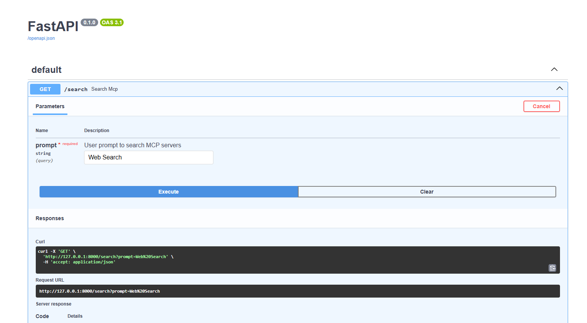

# 🔍 GitHub MCP Server Search API

A FastAPI microservice that lets you search GitHub for **MCP server repositories** using natural language prompts.

Use it to find open-source repositories that implement MCP servers for different tasks like web search, LLM integration, retrieval, etc.

---

## 🚀 How to Use

### ▶️ Step 1: Start the API Server

```bash
python main.py
```

You'll see something like this over terminal:
```bash
Uvicorn running on http://127.0.0.1:8000
```

### ▶️ Step 2: Test the Server

✅ Option A: Using the Browser (Swagger UI)

Open your browser and go to:

```bash
http://127.0.0.1:8000/docs
```

You'll see an interactive API page (Swagger UI)

Expand the /search endpoint

Enter your prompt (e.g., web search) and click Execute

View the JSON response below

🌀 Option B: Using the Terminal (curl)

```bash
curl "http://127.0.0.1:8000/search?prompt=web%20search"
```

Example Output:
```json
{
  "results": [
    {
      "name": "tavily/tavily-search",
      "url": "https://github.com/tavily/tavily-search",
      "description": "A search API for LLMs"
    },
    ...
  ]
}
```
### Example




