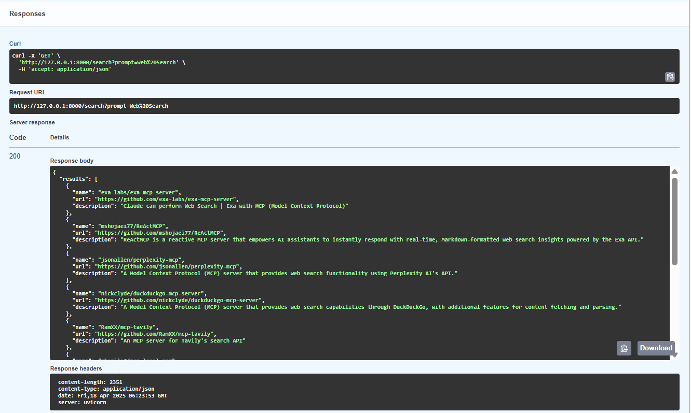

# 🔍 GitHub MCP Server Search API

A FastAPI microservice that lets you search GitHub for **MCP server repositories** using natural language prompts.

Use it to find open-source repositories that implement MCP servers for different tasks like web search, LLM integration, retrieval, etc.

---

## 🚀 How to Use

### ▶️ Step 1: Start the API Server

```bash
python main.py
```

You'll see something like this over terminal:
```bash
Uvicorn running on http://127.0.0.1:8000
```

### ▶️ Step 2: Test the Server

✅ Option A: Using the Browser (Swagger UI)

Open your browser and go to:

```bash
http://127.0.0.1:8000/docs
```

You'll see an interactive API page (Swagger UI)

Expand the /search endpoint

Enter your prompt (e.g., web search) and click Execute

View the JSON response below

🌀 Option B: Using the Terminal (curl)

```bash
curl "http://127.0.0.1:8000/search?prompt=web%20search"
```

For getting responses in better formatted manner in Powershell (🪟)
```shell
(Invoke-RestMethod "http://127.0.0.1:8000/search?prompt=web%20search") | ConvertTo-Json -Depth 5
```

Example Output:
```json
{
  "results": [
    {
      "name": "tavily/tavily-search",
      "url": "https://github.com/tavily/tavily-search",
      "description": "A search API for LLMs"
    }
  ]
}
```
### Example Tests




Response Received:

```json
{
  "results": [
    {
      "name": "exa-labs/exa-mcp-server",
      "url": "https://github.com/exa-labs/exa-mcp-server",
      "description": "Claude can perform Web Search | Exa with MCP (Model Context Protocol)"
    },
    {
      "name": "mshojaei77/ReActMCP",
      "url": "https://github.com/mshojaei77/ReActMCP",
      "description": "ReActMCP is a reactive MCP server that empowers AI assistants to instantly respond with real-time, Markdown-formatted web search insights powered by the Exa API."
    },
    {
      "name": "jsonallen/perplexity-mcp",
      "url": "https://github.com/jsonallen/perplexity-mcp",
      "description": "A Model Context Protocol (MCP) server that provides web search functionality using Perplexity AI's API."
    },
    {
      "name": "nickclyde/duckduckgo-mcp-server",
      "url": "https://github.com/nickclyde/duckduckgo-mcp-server",
      "description": "A Model Context Protocol (MCP) server that provides web search capabilities through DuckDuckGo, with additional features for content fetching and parsing."
    },
    {
      "name": "RamXX/mcp-tavily",
      "url": "https://github.com/RamXX/mcp-tavily",
      "description": "An MCP server for Tavily's search API"
    },
    {
      "name": "nkapila6/mcp-local-rag",
      "url": "https://github.com/nkapila6/mcp-local-rag",
      "description": "\"primitive\" RAG-like web search model context protocol (MCP) server that runs locally. ✨ no APIs ✨"
    },
    {
      "name": "yokingma/one-search-mcp",
      "url": "https://github.com/yokingma/one-search-mcp",
      "description": "🚀 OneSearch MCP Server: Web Search & Scraper & Extract,  Support Firecrawl, SearXNG, Tavily, DuckDuckGo, Bing, etc."
    },
    {
      "name": "LinkupPlatform/python-mcp-server",
      "url": "https://github.com/LinkupPlatform/python-mcp-server",
      "description": "Linkup is a third-party extension that gives Claude access to real-time web search and premium content sources. It seamlessly integrates with Claude Desktop, enabling up-to-date information retrieval during conversations through a simple 60-second setup process."
    },
    {
      "name": "Sunwood-ai-labs/duckduckgo-web-search",
      "url": "https://github.com/Sunwood-ai-labs/duckduckgo-web-search",
      "description": "DuckDuckGo Web Search MCP Server - A simple web search implementation for Claude Desktop using DuckDuckGo API"
    },
    {
      "name": "DappierAI/dappier-mcp",
      "url": "https://github.com/DappierAI/dappier-mcp",
      "description": "Dappier MCP server connects any AI to proprietary, real-time data — including web search, news, sports, stock market data, and premium publisher content."
    }
  ]
}
```
